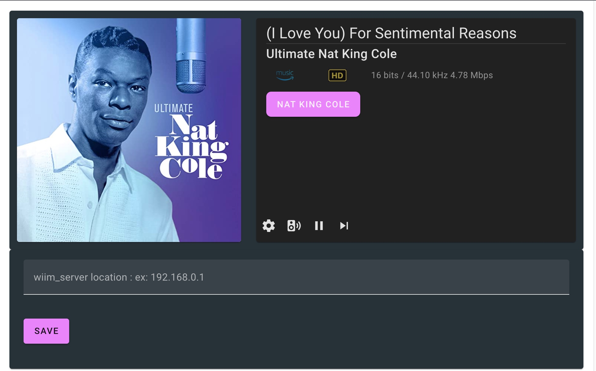

# wiim-mini-ui

### A simple UPnP audio Control Point

This project was inspired by  Ralph Cramden on AudioScienceReview forum. The goal is to build a Web Control Point to display "Now Playing", "Album Art" and provide basic control over the Media Renderers on the local network.

My initial intention was to build a lovely web app for my WiiM mini devices because I missed so much from volumio, logitech media server or roon. Hence, the project name was "WiiM mini UI". Since the web app does interact with all Media Renderers on your system. (As long as it supports proper UPnP. (Sorry for OpenHome users. I'll put that into my to-do list))

Song metata will support **Local DLNA server**, **Spotify**, **Qobuz** and **Amazon Music**. I am sorry I am currently not a subscriber of **TIDAL**.

## Install

Depends on if you are a developer or an end user. There are several ways to hit the ground running.

The system consists of two parts. A backend server (node.js) and an interactive web user interface (vuetify 3).

To be able to compile and run, you need to first install the following tools if you do not have them already.

1. Node.js : please follow the installation here (https://nodejs.org/en/)
2. Yarn : Please follow the installation here (https://classic.yarnpkg.com/lang/en/docs/install/#mac-stable)

Once you have both Node.js and Yarn installed, then rest should be fairly straightforward.
Next step is to run :

3. `yarn install`

this command will install all necessary libraries for you from here.

## Usage

As a developer, you might want to run both back-end and front-end service separately.  Ideally, you do not need to rebuild both projects at the same time so they won't interfere with one other.

### Developer Mode

By running `yarn ui dev` will host a hot-swap version of web server to run the front-end code on **localhost:3000**. Meanwhile, running `yarn server serve` will kick in back-end server on **localhost:8080**.

### Production Mode

If you wish just to build and run, You only need the following commands :

```
yarn ui build
yarn serve
```

These commands will first build the web app into a bundled, minified package. Then the script will copy the productionalized web app into the right place and start the back-end services and host it under the node.js as a static page. In this mode, you really only need to hit **http://localhost:8080** to run the web app.

---

**IMPORTRANT** The web app had a hard coded "server" location inside of /web_client/constants/Constants.ts file. Please change **SERVER_URL** and **SERVER_PORT** accordingly.

---

### Deployment Mode

If you wish to run this web app anywhere else, such as a mini Single Board Computer like a Raspberry Pi or even deploy as a docker container. All you have to do is to run the `yarn ui build` command first. After the building process has finished, you just have to copy **/web_client/dist** directory into a directory where you wish to run the service. For example! If your Node.js is running at **/helloWorld** folder, then you need to copy **/web_client/dist** into **/HelloWorld/public**. After that, just copy **/wiim_server** into **/HelloWorld** directory and run with **node server.js** (after you properly installed by running `npm install`).

1. make a build by running ``yarn ui build`.
2. copy **/web_client/dist** directory into **<destination>/public** directory.
3. copy **/wiim_server/server.js** into **<destination>/** directory.
4. run `node server.js` to start both back-end server and front-end web app.

### How to set up on a Raspberry Pi

1. Grant access through SSH terminal into your Raspberry Pi
2. sudo apt-get update
3. sudo apt-get upgrade
4. sudo apt remove node (If you already had an older version installed)
5. sudo apt remove nodejs (If you already had an older version installed)
6. -fsSL https://deb.nodesource.com/setup_18.x | sudo -E bash - (This command will download latest node.js)
7. sudo apt-get install -y nodejs (Install Node.js)
8. node -v (check if node.js is properly installed)

9. At your current computer, kick in a build by `yarn ui build`
10. Copy **/web_client/dist** into Raspberry Pi to where you want your code to be hosted **<destination>/public**
11. Copy **server.js** and **package.json** files in **/wiim_server/** into your **<destination>** folder on the Raspberry Pi.
12. Run `npm install` to install dependencies.
13. Run `hostname -I` to find out your IP address on the Raspberry Pi.
14. Run `node server.js` to run the Server + Web App.
15. Run a browser to **[Raspberry Pi IP Address] : [Running port number]** You should be able to see the web app running.

### how to make wiim_server service persist and automatically load when booting Raspberry Pi

1. sudo npm install -g pm2 (install pm2)
2. pm2 start server.js (starting wiim_server)

- You should be able to see **App name** Server running

3. pm2 startup systemd (generate a script that will launch PM2)
4. copy the last line starts with **sudo env PATH=$PATH/....** and paste into the terminal and run it
5. pm2 save (save current state of PM2 with server.js running)
6. you will be able to check anytime for the status by commands :

- pm2 list (list of services running under pm2)
- pm2 status (status of pm2)
  = pm2 show server (this will show wiim_server in details)

### If you are haveing build issues, want to skip the whole building process

Reported by users, the building tools might not properly compile on Windows 11. Due to the tool set for building the project mainly used tools to run under Linux/OSX. There i s also a copy of production built web app already placed in the **/wiim_server/public** folder. You should be able to run just by using following commands :

1. cd **wiim_server**
2. **npm install** (run this to pull in all the dependencies for the server)
3. **node server.js** (to run it)

## How to use

You will then need to click on the **SPEAKER** icon to select a Media Renderer on your own network. You should be able to see the screen as follows. Keep in mind! You will need to select a Media Renderer first. Otherwise you won't be able to control playback/pause/next on it.


When you click on the artist name (a pink button), that should bring up a card below the main player.


The server location should host both the **wiim_server** and web app from the same server. However, occasionally during the development, you may have a web app and wiim_server running on different machines or different ports. You may click on the **SETUP** icon to change the IP address.


## Change Logs

- 7/25/22

  - Allow to change server IP address. (The setup icon)
  - Automatically use the default server IP address to start the web app.
  - Hide controller buttons before the user selects a media renderer. (It will cause server crash to force control without a media renderer had been selected
  - Moved the **Media Renderers** under the main display screen to allow more room for long device names.

- 7/24/22
  - moved backend from RESTful requests into Websocket communication to give real time feedback
  - updated metadata accuracy. Now will display Spotify, Qobuz, Amzon Music and local UPnP media servers.
    - Quboz will display CD or Hi-Res
    - Amazon Music will display UHD or HD
    - Spotify will display MP3 (Don't ask me when are we seeing Hi-Res from Sptify!)
    - Local UPnP depends on the bitrate. It will display Hi-Res or CD

## TO-DO list

1. During Developer Mode, Vue + Vuetify + Vite + TypeScript simply doesn't like to pull in icon assets properly. (Probably because both Vue 3 and Vuetify 3 were still in alpha?
2. Possibility to support OpenHome protocol for controlling the renderer (currently it will display metadata but fast track to next track won't work as OpenHome system design was to have playlist saved on individual "client". Therefore, it's not possible to advance to next track becauser there was no "next track" available). This will affect all BubbleUPnP renderers such as Chromcast, Volumio.
3. Local UPnP Media Server would be able to stream more than just CD/Hi-Res options. The options would be LOSSY, LOSSLESS..etc... The metadata is sometimes very limited.
