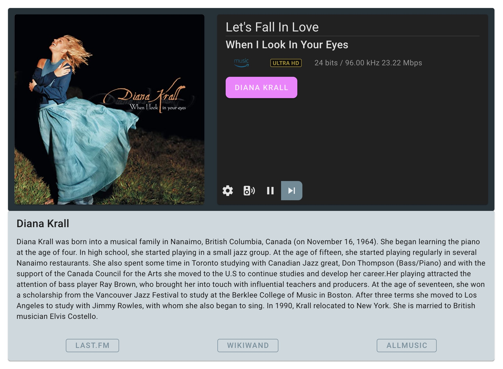

# wiim-mini-ui

### A simple UPnP audio Control Point

This project was inspired by  Ralph Cramden on AudioScienceReview forum. The goal is to build a Web Control Point to display "Now Playing", "Album Art" and provide basic control over the Media Renderers on the local network.

My initial intention was to build a lovely web app for my WiiM mini devices because I missed so much from volumio, logitech media server or roon. Hence, the project name was "WiiM mini UI". Since the web app does interact with all Media Renderers on your system. (As long as it supports proper UPnP. (Sorry for OpenHome users. I'll put that into my to-do list))

## Install

Depends on if you are a developer or an end-user. There are several ways to hit the ground running.

The system consists of two parts. A backend server (node.js) and an interactive web user interface (vuetify 3).

To be able to compile and run, you need to first install the following tools if you do not have them already.

1. Node.js : please follow the installation here (https://nodejs.org/en/)
2. Yarn : Please follow the installation here (https://classic.yarnpkg.com/lang/en/docs/install/#mac-stable)

Once you have both Node.js and Yarn installed, then rest should be fairly straightforward.
Next step is to run :

3. `yarn install`

this command will install all necessary libraries for you from here.

## Usage

As a developer, you might want to run both back-end and front-end service separately.  Ideally, you do not need to rebuild both projects at the same time so they won't interfere with one other.

### Developer Mode

By running `yarn ui dev` will host a hot-swap version of web server to run the front-end code on **localhost:3000**. Meanwhile, running `yarn server start` will kick in back-end server on **localhost:8080**.

### Production Mode

If you wish just to build and run, You only need the following commands :

```
yarn ui build
yarn serve
```

These commands will first build the web app into a bundled, minified package. Then the script will copy the productionalized web app into the right place and start the back-end services and host it under the node.js as a static page. In this mode, you really only need to hit **http://localhost:8080** to run the web app.

### Deployment Mode

If you wish to run this web app anywhere else, such as a mini Single Board Computer like a Raspberry Pi or even deploy as a docker container. All you have to do is to run the `yarn ui build` command first. After the building process has finished, you just have to copy **/web_client/dist** directory into a directory where you wish to run the service. For example! If your Node.js is running at **/helloWorld** folder, then you need to copy **/web_client/dist"" into **/HelloWorld/public**. After that, just copy **/wiim_server** into **/HelloWorld** directory and run with **node server.js\*\*.

1. make a build by running ``yarn ui build`.
2. copy **/web_client/dist** directory into **<destination>/public** directory.
3. copy **/wiim_server/server.js** into **<destination>/** directory.
4. run `node server.js` to start both back-end server and front-end web app.

### How to use

When you first landed on the web app. You should see the broken UI (It's on my to-do list to fix that). You will first need to click on the **SPEAKER** icon to select a Media Renderer on your own network. You should be able to see the screen as follows.


When you click on the artist name (a pink button), that should bring up a card below the main player.


### TO-DO list

1. Default screen should be more graceful when a player isn't selected. Also bug fixes when metadata is incomplete from the server side so it will exit from unexpected behaviors.
2. During Developer Mode, Vue + Vuetify + Vite + TypeScript simply doesn't like to pull in icon assets properly. (Probably because both Vue 3 and Vuetify 3 were still in alpha?
3. Possibility to support OpenHome protocol so the web app can also control Volumio player, Chromecast over BubbleUPnP, etc...)
